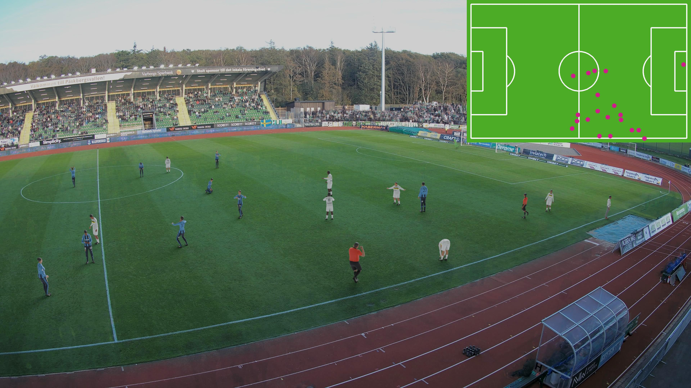
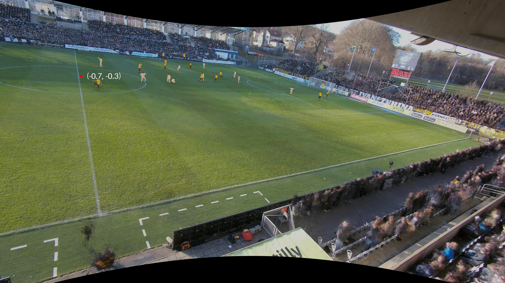
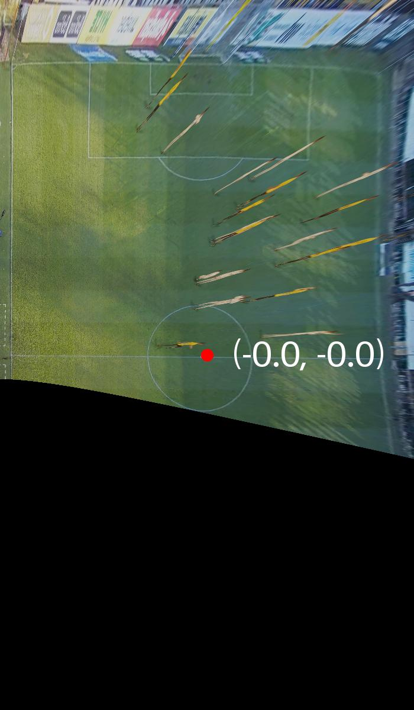

<div align="center">

# Spiideo SoccerNet SynLoc
## Single Frame World Coordinate Athlete Detection and Localization with Synthetic Data

[[Paper](https://arxiv.org/)] [[Baseline](https://github.com/Spiideo/mmpose/tree/spiideo_scenes)] [[Devkit](https://github.com/Spiideo/sskit)]

</div>

>**[Spiideo SoccerNet SynLoc - Single Frame World Coordinate Athlete Detection and Localization with Synthetic Data](https://arxiv.org/)**
>
> ...
>
>[*arxiv*](https://arxiv.org/)
>



Welcome to the Development Kit for the Spiideo SoccerNet SynLoc task and Challange. This kit is meant as a help to get started working with the data and the proposed task.

## Installation
The easiest way to install sskit is to use pip:
```bash
  pip install sskit
```

It is also possible to build manually:
```bash
  git clone https://github.com/Spiideo/sskit.git
  cd sskit
  python setup.py install
```

## mAP-LocSim Evaluation

Tools for evaluating a solution using the proposed mAP-LocSim metrics can be found in `sskit.coco`. It's an adaption of
[`xtcocotools`](https://pypi.org/project/xtcocotools/), and is used in a similar way. Annotations and results are stored
in coco format with the ground location of the objects projected into the image as the second keypoint. To evaluate
results on the validation set stored in `validation_results.json`, use:
```python
  from xtcocotools.coco import COCO
  from sskit.coco import LocSimCOCOeval

  coco = COCO('data/annotations/val.json')
  coco_det = coco.loadRes("validation_results.json")
  coco_eval = LocSimCOCOeval(coco, coco_det, 'bbox', [0.089, 0.089], True)
  coco_eval.params.useSegm = None

  coco_eval.evaluate()
  coco_eval.accumulate()
  coco_eval.summarize()

  score_threshold = coco_eval.stats[15]
```

This will select a score threshold that maximizes the F1-score, which will make that score biased for the validation set.
To get unbiased scores on the test-set, the score threshold found for the validation set should be used there:
```python
  from xtcocotools.coco import COCO
  from sskit.coco import LocSimCOCOeval

  coco = COCO('data/annotations/test.json')
  coco_det = coco.loadRes("test_results.json")
  coco_eval = LocSimCOCOeval(coco, coco_det, 'bbox', [0.089, 0.089], True)
  coco_eval.params.useSegm = None
  coco_eval.params.score_threshold = score_threshold

  coco_eval.evaluate()
  coco_eval.accumulate()
  coco_eval.summarize()
```

## Camera model

The camera model used in the dataset is a standard projective pihole camera model with radial distortion.
There are several different coordinate systems used (se pictures below), and functions to convert points
between them can be found in `sskit`. The World coordinates are either 3D or 2D ground coordinates with
the last coordinate assumed to be 0. The graph below shows the different coordinate systems and how they
relate to eachother:
```mermaid
  graph LR;
  Camera -- normalize() --> Normalized
  Normalized -- unnormalize() --> Camera
  Normalized -- undistort() --> Undistorted
  Undistorted -- distort() --> Normalized
  Undistorted -- undistorted_to_ground() --> World
  World -- world_to_undistorted() --> Undistorted
  World -- world_to_image() --> Normalized
  Normalized -- image_to_ground() --> World
```

To for eaxample project the center of the pitch, world coordinate (0,0,0), into the pytorch image, `img`, using a
camera matrix, `camera_matrix` and distortion parameters, `dist_poly`, from the dataset, use:
```python
  from sskit import unnormalize, world_to_image

  unnormalize(world_to_image(camera_matrix, dist_poly, [0.0, 0.0, 0.0]), img.shape)
```

A more comprehensive example that was used to create the illustrations below can be found in [`coordinate_systems.py`](coordinate_systems.py).

### Camera Image


### Normalized Image


### Undistorted Image


### Ground Plane

