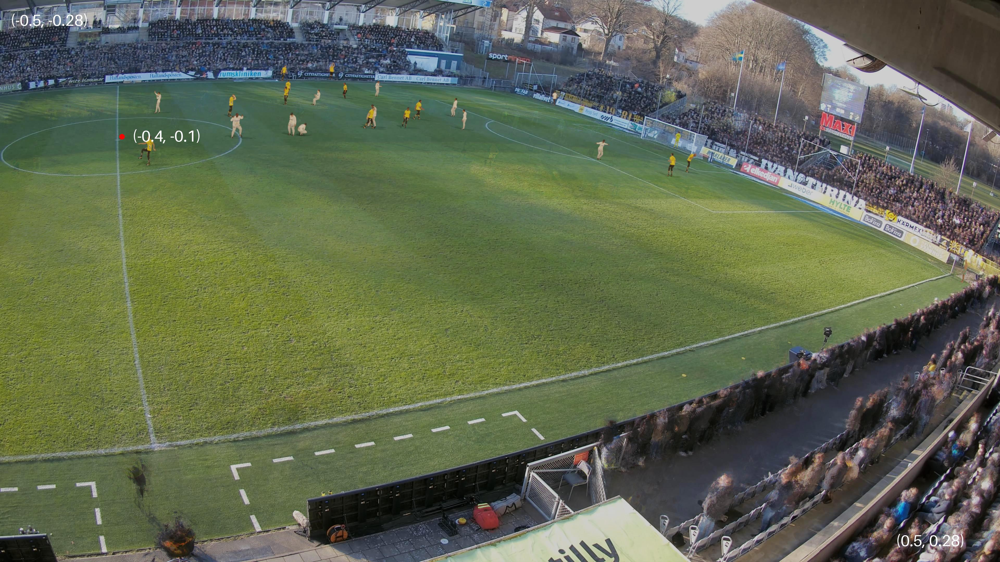

# Spiideo SoccerNet SynLoc
## Single Frame World Coordinate Athlete Detection and Localization with Synthetic Data

[[Paper](https://arxiv.org/)] [[Baseline](https://github.com/Spiideo/mmpose/tree/spiideo_scenes)] [[Devkit](https://github.com/Spiideo/sskit)]

>**[Spiideo SoccerNet SynLoc - Single Frame World Coordinate Athlete Detection and Localization with Synthetic Data](https://arxiv.org/)**
>
> ...
>
>[*arxiv*](https://arxiv.org/)
>

## Coordinate Systems

There are several different coordinate systems used (se pictures below), and functions to convert points between them. The World coordinates are either 3D or 2D ground coordinates with the last coordinate assumed to be 0.

```mermaid
  graph LR;
  Camera -- normalize() --> Normalized
  Normalized -- unnormalize() --> Camera
  Normalized -- undistort() --> Undistorted
  Undistorted -- distort() --> Normalized
  Undistorted -- undistorted_to_ground() --> World
  World -- world_to_undistorted() --> Undistorted
  World -- world_to_image() --> Normalized
  Normalized -- image_to_ground() --> World
```

### Camera Image

### Normalized Image

### Undistorted Image

### Ground Plane

